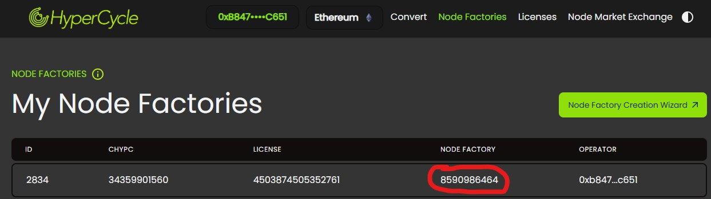
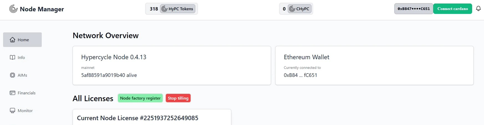
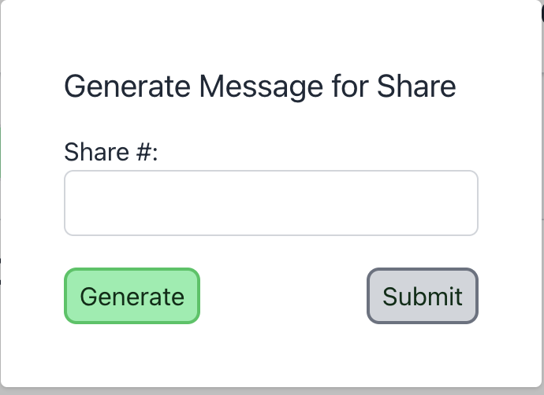
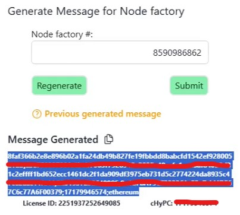
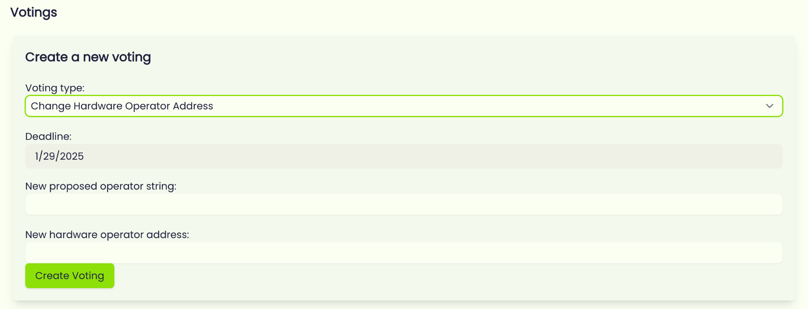

# Activating your Node Manager with Node Factory

## <mark style="color:purple;">**Activating with a Node Factory**</mark> 

1. Goto the Node Factory list in your [dapp.hypc.ai](http://dapp.hypc.ai/) and copy the Node Factory number (circled in red) of the NF you want to assign to your node:

2. Open web browser, go to your Node manager admin panel, commonly located at [http://LAN-IP:8006](http://localhost:8006/), and click on the green “*Node Factory Register*” button next to “All Licenses”. (If you already have an existing license for HBox owners or NF tilling that you want to change, first click on the red “Stop tilling” button”):

3. Paste your Node Factory number from the dapp there and click **Generate:**

4. Copy the Message Generated (highlighted section below “Message Generated”)

5. Go to your Node Factory Management page to create a new vote, “Change Hardware Operator Address”

6. Change Deadline to be at least 24 hours long.
7. In New proposed operator string field, paste the string generated by the node.
8. In New hardware operator address, paste the wallet address of the Node Factory.
9. Create Voting.
10. Approve the vote.
11. Go back to the Node Admin panel and,then click on **Generate Message “Submit”**
12. The Node Factory will be registered to activate your Node. Wait a few hours before checking the Info status page in the Admin panel or the HyperCycle Explorer for tilling status. You may need to restart the Node Manager for settings to take effect.
