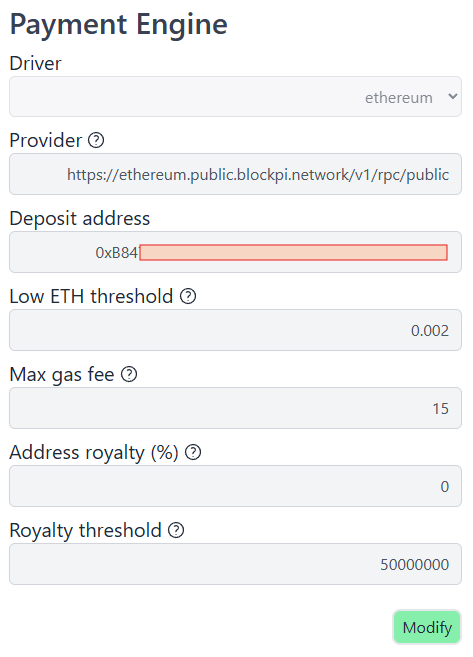
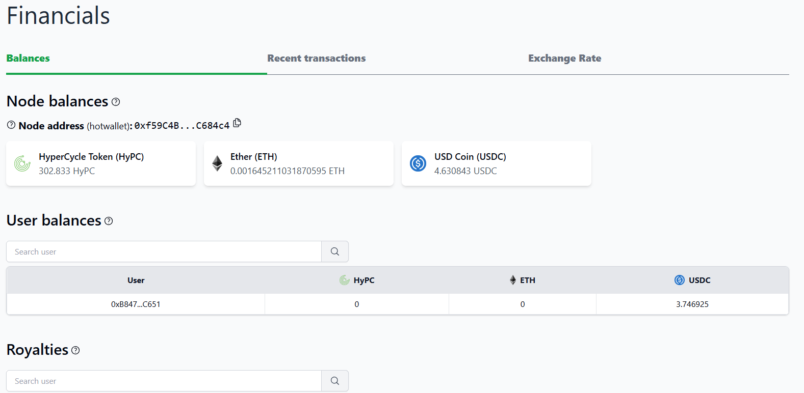

# HyperCycle AIM Deployment

### AIM (AI Machine) Intro & Deployment

**The AIM is at the core of HyperCycle's Internet of AI (IoAI) ecosystem. Hypercycle** is a decentralized platform designed for running AI services in a peer-to-peer network. It enables trustless, metered access to AI computation, allowing providers to monetize their services and consumers to pay only for what they use. AIMs are the worker bees, they make all the honey, let us begin!!

* #### [<mark style="color:purple;">What is an AIM</mark>](#what-is-an-aim-1)
* #### [<mark style="color:green;">Setting up Payment Engine</mark>](#setting-up-the-payment-engine)
* #### [<mark style="color:yellow;">AIM Deployment Guides</mark>](#aim-deployment-guides-1)
* #### [<mark style="color:orange;">AIM Operation & Maintenance</mark>](#aim-operation-and-maintenance-1)

### <mark style="color:purple;">What is an AIM</mark>

An **AIM (AI Machine)** is essentially a Docker container that hosts a specific AI service. It operates independently from the Node Manager, exposing an API endpoint that the Node Manager can call. The AIM is responsible only for handling the service logic and defining the cost per request. It doesn’t need to worry about blockchain interactions, user authentication, or payments — the Node Manager takes care of all of that.

#### How the Hypercycle System Works

1. **Node Manager Installation**\
   At the heart of the HyperCycle infrastructure is the **Node Manager** — software that runs on a host machine (typically Ubuntu Linux) and facilitates interaction between the blockchain, the AIMs, and the wider Hypercycle network. This software acts as the operational core of a Hypercycle node.
2. **AIM Installation via API or UI**\
   The Node Manager provides a REST API and a web-based admin interface that allow the node operator to install and manage AIMs. Operators can choose from a list of available AIMs or deploy custom ones.
3. **Service Discovery in the P2P Network**\
   Once an AIM is installed and registered, the Node Manager advertises its available services to the Hypercycle peer-to-peer network. This makes the services discoverable by other nodes and potential consumers.
4. **Opening a Payment Channel**\
   A consumer who wants to use a service can open a payment channel with the node by depositing **USDC** (USD Coin) on the **Ethereum** or **Base** blockchain. This channel acts like a prepaid balance.
5. **Off-Chain Service Calls and Payments**\
   To invoke services, consumers send signed requests. These signatures prove their intent to spend a certain amount from their balance — all without requiring an on-chain transaction for each service call. This off-chain model reduces latency and gas costs.
6. **Node Manager Responsibilities**\
   The Node Manager handles:

   * Blockchain interactions (e.g., deposits, withdrawals)
   * Verifying signatures
   * Deducting payments from consumer balances
   * Paying royalties or fees to AIM creators and infrastructure providers

   This allows the AIM itself to stay lightweight and focused entirely on its service logic.
7. **How the Hypercycle System Works**

   Node Manager Installation\
   At the heart of the HyperCycle infrastructure is the **Node Manager,** software that runs on a host machine (typically Ubuntu Linux) and facilitates interaction between the blockchain, the AIMs, and the wider Hypercycle network. This software acts as the operational core of a Hypercycle node.

### <mark style="color:green;">Setting up Payment Engine</mark>

Prior to deploying AIMs and accepting payments for their use, we need to setup the Payment Engine. The Payment Engine is accessed via the Node Manager UI under the Settings tab:

<figure><figcaption></figcaption></figure>

* <mark style="color:green;">**Driver**</mark><mark style="color:green;">:</mark> one of three options
  * *null* for Testnet
  * *ethereum* for Mainnet
  * *basechain* for Mainnet
* <mark style="color:green;">**Provider**</mark>: URL of an HttpProvider for the network that allows the payment engine to query transactions on chain. You must enter a network-based provider.&#x20;
* <mark style="color:green;">**Deposit Address**</mark>: a valid wallet address on the network defined by the <mark style="color:green;">Driver.</mark> This can be any cold or hot wallet you control. When the <mark style="color:green;">Royalty threshold</mark> is met, the node will send funds collected from AIM operations and other node deposits to this address.&#x20;
* <mark style="color:green;">**Low ETH threshold**</mark>: Warning when the hot wallet of the node has low ETH balance, and is measured using ETH as the unit. Default is 0.2 ETH.&#x20;
  * If the balance of the node's hot wallet goes below this threshold, a narrow yellow banner will appear across the top of each page alerting you.
* <mark style="color:green;">**Max gas fee**</mark>: Maximum gas fee to spend in a transaction with a node hot wallet, expression measured using GWei as the unit. Default is 80 GWei.
* <mark style="color:green;">Address royalty (%)</mark>: Percentage to split the royalties between the Deposit address and the node operator. This setting is skipped if the node is using a Freelancing License and will be using the Revenue split with the license owner address instead.
* <mark style="color:green;">Royalty threshold</mark>: The minimum threshold to trigger the royalties payouts. Remember to include all the decimals, for example: 50USDC is equal to 50000000

<mark style="color:yellow;">Important:</mark> When the Payment Engine is initialized by changing the default <mark style="color:green;">Driver</mark> from *null* to another, the node generates a hot wallet and activates the ***Financials*** page.&#x20;

This is where *Node balances*, *Node address* (hot), *User Balances*, *Royalties (including the option to manually trigger their payouts)*, *Recent Transactions* and *Exchange Rates* can be found and managed.&#x20;

<figure><figcaption></figcaption></figure>

Payment Engine settings are stored in:

```
/home/hypercycle/config/config.yaml
```

&#x20;This file also stores other custom settings like node\_address, node\_id, node\_name, etc.

```
network: mainnet
node_address: 192.168.1.100:8000
node_host: 0.0.0.0
node_id: 5af88591a9019b40
node_name: KUKUNA-HBOX
node_port: 8000
payment_engine:
  address: '0xB8...651'
  address_royalty: 0
  driver: ethereum
  low_eth_threshold: '0.002'
  max_gas_fee: '15'
  provider_url: https://ethereum.public.blockpi.network/v1/rpc/public
  royalty_threshold: 50000000
priority: 0
update_check_rate: 10
upgrade_bucket_url: 

```

Note: If the payment\_engine settings are not present in config.yaml, the engine is not active and default values are used.

### <mark style="color:yellow;">AIM Deployment Guides</mark>

* [<mark style="color:$primary;">Boinc AIM install and Einstein registration</mark>](hypercycle-aim-deployment/deploy-boinc-aim-and-register-with-einstein-home.md)
  * HyperAIBox friendly, arm64/amd64&#x20;
* [Deploy Tortoise Text-to-Speech AIM w/Voiceboard UI & USDC Payments](hypercycle-aim-deployment/deploy-tortoise-text-to-speech-aim-w-voiceboard-ui-and-usdc-payments.md)
  * GPU +10GB req, arm64/amd64
* [Deploy Ollama AIM w/UI & USDC Payments](hypercycle-aim-deployment/deploy-ollama-aim-w-ui-and-usdc-payments.md)
  * CPU ok, GPU recommended, arm64/amd64
  * UI is HyperAIBox friendly&#x20;
* [Deploy Litellm AIM w/UI & USDC Payments](hypercycle-aim-deployment/deploy-litellm-aim-w-ui-and-usdc-payments.md)
  * HyperAIBox friendly, arm64/amd64&#x20;

### <mark style="color:orange;">AIM Operation & Maintenance</mark>

### **For removing AIM**

* Via the Node Manager admin panel, goto AIMs tab, click on <mark style="color:orange;">**Delete**</mark>
* Via command line (note aim slot when running more than one aim):

```
curl -XPOST http://localhost:8005/remove_aim/0
```

### **For deploying AIM**

* Via the Node Manager admin panel, goto AIMs tab, search for AIM, click on <mark style="color:orange;">**View**</mark>
* Via command line (note aim slot when running more than one aim)
  * Note the port, 9000 is always the first available port, then 9001, 9002, etc.&#x20;



```
curl http://localhost:8005/add_aim -d '{"name": "aim-name", "tag": "0.1.0", "port": 9000}'
```



### Retry/Restart AIM <a href="#retry-and-remove" id="retry-and-remove"></a>

* Via the Node Manager admin panel, goto AIMs tab, click on running AIM, then <mark style="color:orange;">Restart</mark>
* Via command line,  note the \<aim\_slot>, i.e. slot 0 for the first aim:

```
curl http://localhost:8005/retry_aim/<aim_slot>
```

### **AIM status tests**

```
docker stats
```

(realtime aim usage of system resources)

```
docker ps
```

(for listing active containers)

```
docker logs <container_ID>
```

(gives you detailed log output about what the AIM is doing, i.e. useful for download status of ollama model after aim deployment)

```
docker exec -it <container_ID> bash
```

(for accessing container as bash root, useful for troubleshooting, probing, debug. Generally speaking, AIMs deployed via HyperCycle's registry have gone through extensive testing and audit and don't require this tool. Changes made to a running container are not persistent after restart)
