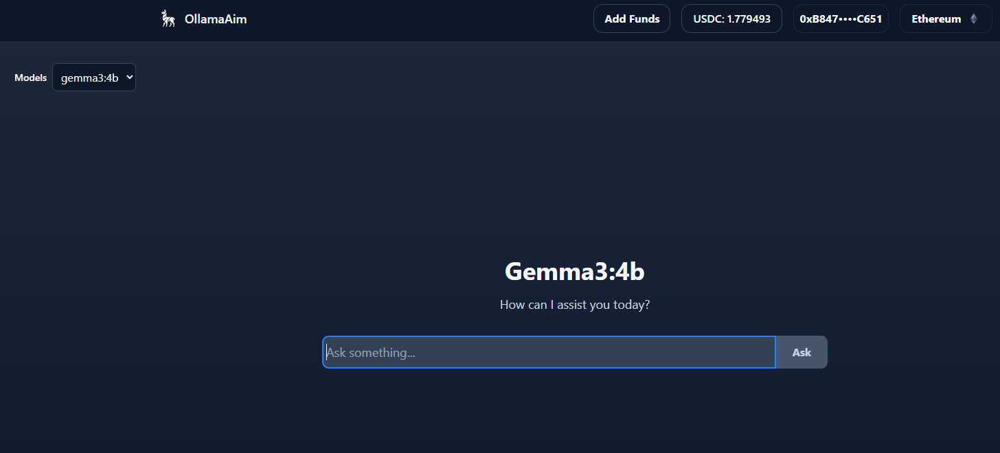
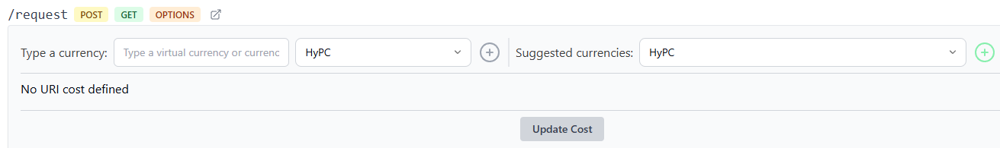

# Deploy Ollama AIM w/UI & USDC Payments

Pre-requisites: CPU ok for smaller models, NVIDIA GPU recommended.

Here we deploy our Ollama AIM along with an <mark style="color:$success;">ETH/USDC</mark> payment accepting chat box UI. GPU is optional for this exercise and highly recommended for the larger LLMs that Ollama can serve.

* Ollama is a **runtime / management framework** for large-language models (LLMs) that lets you download, run, and serve these models on your **local machine**.
* In addition to the AIM, we'll be setting up a separate local instance of an Ollama web-UI responsible for wallet connect, payment deposit, and an easy to use familiar chat interface.&#x20;

### <mark style="color:purple;">**1. Open your Ubuntu 22.04.5 LTS app**</mark> and run <mark style="color:yellow;">htop</mark> for a baseline resource utilization check:

```
htop
```

&#x20;(Take note i.e, Tasks=48, Mem=1.33GB, CPUs mostly idle)

### <mark style="color:purple;">**2. Deploy AIM**</mark>

* Goto local PC web browser and open:

<mark style="color:yellow;"><http://LAN-IP:8006/aims></mark>

* Use search box, type *<mark style="color:yellow;">**ollama**</mark>* to display the “ollama-aim” (ignore the other ollama-alternative-aim).
* Click on *<mark style="color:blue;">**View**</mark>*
* This will provide AIM Details. &#x20;
  * Under <mark style="color:yellow;">**Select tag**</mark>, choose version <mark style="color:yellow;">l</mark><mark style="color:yellow;">**atest**</mark>
  * Note the "GPUs: 0+" under Tag Details. This tells us the AIM will use a GPU if present but not mandatory for deploying this aim.
  * Under *AIM Environments*, note the <mark style="color:orange;">OLLAMA\_MODEL</mark> field. By default it is <mark style="color:$success;">gemma2:2b</mark>. This model is a beginner, lite load model that can run on CPU only.&#x20;
* If you want to test other models, below is a small table of models available through the ollama aim that can be tested for CPU and GPU load. This is not a complete list of available models. You can find those here <https://ollama.com/library> (click on the desired model to see list of available model names, those are the names entered into the environment field prior to deploy):

<table data-header-hidden><thead><tr><th align="center"></th><th width="88" align="center"></th><th align="center"></th><th align="center"></th></tr></thead><tbody><tr><td align="center"><mark style="color:green;">Model</mark></td><td align="center"><mark style="color:green;">Size / Params</mark></td><td align="center"><mark style="color:green;">Approx RAM / VRAM Requirement</mark></td><td align="center"><mark style="color:green;">Notes on hardware resources</mark></td></tr></tbody></table>

<table data-header-hidden><thead><tr><th align="center"></th><th width="88" align="center"></th><th></th><th></th></tr></thead><tbody><tr><td align="center">gemma2:2b</td><td align="center">~2 B</td><td>≈ 8 GB VRAM / 12–32 GB system RAM</td><td>Runs fine on CPU or small GPU; ideal entry-level Gemma 2 variant.</td></tr></tbody></table>

<table data-header-hidden><thead><tr><th align="center"></th><th width="88" align="center"></th><th></th><th></th></tr></thead><tbody><tr><td align="center">gemma3:4b</td><td align="center">~4 B</td><td>≈ 6 GB VRAM / 16–32 GB RAM</td><td>More demanding; still usable on mid-range GPUs (RTX 3060+).</td></tr></tbody></table>

<table data-header-hidden><thead><tr><th align="center"></th><th width="88" align="center"></th><th></th><th></th></tr></thead><tbody><tr><td align="center">mistral:7b</td><td align="center">~7 B</td><td>≈ 8–16 GB VRAM / 32–64 GB RAM</td><td>Popular balanced model; prefers a dedicated GPU for good speed.</td></tr></tbody></table>

<table data-header-hidden><thead><tr><th align="center"></th><th width="88" align="center"></th><th></th><th></th></tr></thead><tbody><tr><td align="center">llama3:8b</td><td align="center">~8 B</td><td>≈ 10–16 GB VRAM / 32 GB RAM</td><td>Meta’s efficient 8B model; needs GPU for real-time inference, good general-purpose reasoning.</td></tr></tbody></table>

* The node has a range of ports available for aim deployments. Starting with 9000 and going to 9100. The first aim will take port 9000, the second 9001, and so on. The aim slot number is the last number of the port, i.e. port 9000, slot = 0.
* Click on *<mark style="color:green;">**Deploy**</mark>*
  * Note: if you deploy the default model and later want to change it, simply come back to your running AIM and modify the OLLAMA\_MODEL. The service will restart.&#x20;
* This will initiate downloading the aim image and starting up the aim. Depending on their size (listed under AIM Details), some aim images take a while to download. You can click on the **Back** button to view the deployed machines and their status.&#x20;
  * If you get a "download failed" message, go back to the main AIMs page and click "Retry" under the deployed machines list. This AIM in particular is 1.67GB.&#x20;
  * <mark style="color:$warning;">Note: This AIM takes about 4min after it has entered a running state to be available for use. This is due to downloading the desired model. UI calls made prior will error out. You can monitor the progress of the download by looking at the docker logs for the container:</mark>

```
#list running containers
docker ps
#view container logs
docker logs <container_ID>
```

* <mark style="color:green;">Optional:</mark> You can choose to deploy the "ollama-alternative-aim", however the default model (gemma3:1b) is more GPU intensive and may not play well with CPU only setup. &#x20;
  * What's the difference between the two ollama aims? The "ollama-aim" approach uses a Python based image and installs Ollama into the container using curl. Sometimes, Ollama gets stuck (open source, public repos) and never returns a response. The alternative takes a reversed approach, the base image is Ollama, and it’s extended to run the AIM server on top, which helps avoid blocking calls.

<mark style="color:orange;">Alternate command line AIM deploy method</mark>



```
curl http://localhost:8005/add_aim -d '{"name": "ollama-aim", "tag": "latest", "port": 9000}'
```



### <mark style="color:purple;">**3. Setup Ollama web UI**</mark>

* Via command line you'll be creating an install script that clones a public GitHub repo and sets up the Ollama web UI via a vite/npm web server running in a tmux session.&#x20;
  * Install script will prompt you for your UI host IP and AIM host IP. You can install this on the same machine that runs your node, or on another machine running the Ubuntu OS on the same network (unless you open up port forwarding/firewall for traversal across Internet). Make sure you are in your home directory, i.e., "/home/hyperai".&#x20;
* Copy and paste the block below directly into the terminal. It will create a file called "<mark style="color:yellow;">ollama-ui-install.sh</mark>":



```
curl -L -o ollama-ui-install.sh \
  https://raw.githubusercontent.com/cybershaman73/ollama-aim-ui/refs/heads/main/ollama-ui-install.sh
```



* After creating the file, we'll make it executable and run it:

```
chmod +x ollama-ui-install.sh
./ollama-ui-install.sh
```

* After installation, you will see a status message with further direction on how to interact with the web UI server's tmux session, including how to stop and restart it.&#x20;
* If you do not stop the tmux session, the UI server will continue running after exiting the command shell session. tmux sessions do not persist past system restarts.&#x20;

### <mark style="color:purple;">**4. Access the Ollama UI**</mark>

Now it's time to chat!!&#x20;

During the web UI install process, you provided the web port for the UI server. For the purpose of this example, we'll assume you installed the UI on the same machine running the node:

<mark style="color:yellow;"><http://LAN-IP:8880></mark>

* This opens the web page. There's a MetaMask wallet connector in the upper right corner. Upon wallet connect you'll be prompted for a signature (nonce, no fee).&#x20;

<figure><figcaption></figcaption></figure>

* The page will open listing the active model and chat box. You can ignore the Model drop down in the top left for this exercise, there's only ever one model loaded.&#x20;
* As a node operator, you have control over the cost of these AIM calls. By default, the cost of each call will be $0.02. For testing, you can also set it to zero, under the URI Settings > Paid URIs of the AIM:
  * <http://LAN-IP:8006/aims/0>
    * Scroll down to the "/request POST" URI.
    * Click on "Suggested currencies:" and choose USDC and click the plus sign.&#x20;
    * Make it "Fixed" and assign the cost. <mark style="color:$warning;">This value is in micro-USDC.</mark> For example, to make the cost value 1 USDC, you enter "1000000"&#x20;
    * Click on "Update Cost"&#x20;

<figure><figcaption></figcaption></figure>

* You can make <mark style="color:$success;">ETH/USDC</mark> deposits to the node manager via the "Add Funds" button on the top menu. Once the Tx settles on chain, you'll see the "USDC:" balance update.&#x20;
* Depending on the complexity of your chat request and the performance of your hardware, processing times vary from 15secs to a minute depending on your setup. Here's some test queries to run:
  * Knowledge / recall:

    “List the layers of Earth’s atmosphere and typical altitude ranges for each in km.”

    “Summarize the purpose of the ionosphere in 2 bullet points.”
  * Reasoning / math:

    “If a satellite orbits at 400 km altitude with speed 7.7 km/s, estimate its orbital period in minutes.”
  * Robustness:

    “Return a JSON object {‘layers’: \[name, min\_km, max\_km]} for Earth’s atmosphere. No extra text.”

### <mark style="color:yellow;">GPU Usage Monitoring</mark>

* Monitoring your GPU during SPEAK processing can be useful in determining your GPU's performance, temperature, mem usage and overall process flow. Here we'll be installing "nvtop" to monitor your NVIDIA GPU:



```
sudo apt update
sudo apt install -y git cmake build-essential libncurses5-dev libncursesw5-dev libdrm-dev pkg-config
git clone https://github.com/Syllo/nvtop.git
cd nvtop
mkdir -p build && cd build
cmake -DCMAKE_BUILD_TYPE=Release -DNVIDIA_SUPPORT=ON -DAMDGPU_SUPPORT=OFF -DINTEL_SUPPORT=OFF -DV3D_SUPPORT=OFF ..
make -j"$(nproc)"
sudo make install
```



```
nvtop --version
nvtop
```

* This will open a graphical display similar to htop to monitor your GPU usage. Note, this install method only runs nvtop for the user that installed it.&#x20;

### <mark style="color:yellow;">GPU Usage Control</mark>

<mark style="color:$danger;">Important note:</mark> GPU usage for Ollama AIM is on demand. Spikes occur only during processing of the chat request. While not likely, depending on demand, this may cause overheating or excessive power use. The most reliable way to reduce overall % usage of the GPU is to cap power utilization. Keep in mind, capping the power below the average VRAM requirement for the chosen model will likely cause the process to fail. Use nvtop to determine your usage thresholds.&#x20;

<mark style="color:yellow;">The following commands will only work for bare metal installations. For those of you running WSL, the same commands can be applied via Windows PowerShell as administrator.</mark>

You can check your power limits and range via terminal:

```
nvidia-smi -q -d POWER
```

Then if the default power limit is 250W for example, you can set the power limit to 50% or 125W like this:

```
nvidia-smi -pl 125
```

We can also if desired, have more granular control of GPU clock. Check your GPU clock ranges:

```
nvidia-smi -q -d SUPPORTED_CLOCKS
```

Locking Clocks is optional for finer control. You can fix GPU core/memory clocks to lower values (values given are examples):

```
nvidia-smi --lock-gpu-clocks=900,1200
nvidia-smi --lock-memory-clocks=5000,5000
```
