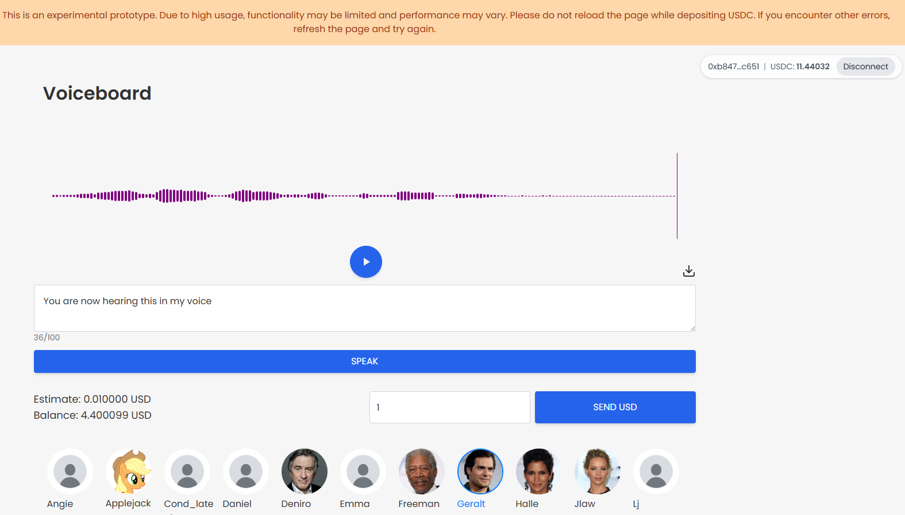
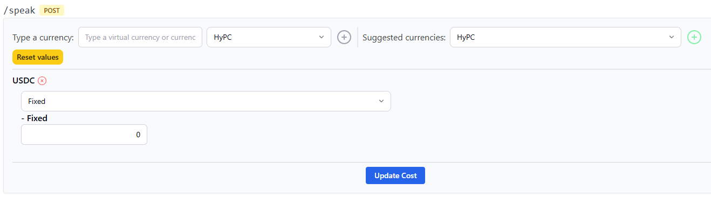

# Deploy Tortoise Text-to-Speech AIM w/Voiceboard UI & USDC Payments

Pre-requisites: NVIDIA GPU with 10GB VRAM.

Here we test deployment of an AIM with an <mark style="color:$success;">ETH/USDC</mark> payment accepting UI. GPU must have at least 8GB free VRAM. Note that system processes will sometimes take up to 1GB VRAM from the GPU, this AIM requires at least 8GB to be free. This eliminates GPUs that come with 8GB VRAM.

* In this exercise, we’ll be deploying the Tortoise Text-to-Speech AIM. This AIM is an AI module that transforms text input into realistic human-sounding speech using advanced deep-learning voice synthesis. It supports multiple preset and custom voices and high-fidelity audio output suitable for narration, dialogue, or multimedia generation. The AIM handles text processing, model inference, and downloadable (wav) audio output entirely within a containerized HyperCycle runtime.
* In addition to the AIM, we'll be setting up a separate local instance of a Voiceboard web-UI responsible for wallet connect, payment deposit, text to speech cost estimator, a menu of popular voice avatars and a simple audio playback/download widget.&#x20;

### <mark style="color:purple;">**1. Open your Ubuntu 22.04.5 LTS app**</mark> and run <mark style="color:yellow;">htop</mark> for a baseline resource utilization check:

```
htop
```

&#x20;(Take note i.e, Tasks=48, Mem=1.33GB, CPUs mostly idle)

### <mark style="color:purple;">**2. Deploy AIM**</mark>

* First, determine your NVIDIA GPU card model's compute capability. For this AIM, a GPU with anything higher than V9.0 compute capability will not work due to cuda driver compatibility issues  (at the time of this guide. V12.0 AIM has been built and awaiting merge). Visit the CUDA GPU Compute Capability site:
  * <https://developer.nvidia.com/cuda-gpus>
* If you're set, goto local PC web browser and open:

<mark style="color:yellow;"><http://LAN-IP:8006/aims></mark>

* Use search box, type *<mark style="color:yellow;">**tortoise**</mark>* to display the “tortoise-tts” (ignore the other tortoise-tts-aim-gen).
* Click on *<mark style="color:blue;">**View**</mark>*
* This will provide AIM Details. Under <mark style="color:yellow;">**Select tag**</mark>, choose version <mark style="color:yellow;">l</mark><mark style="color:yellow;">**atest**</mark>
* The node has a range of ports available for aim deployments. Starting with 9000 and going to 9100. The first aim will take port 9000, the second 9001, and so on. The aim slot number is the last number of the port, i.e. port 9000, slot = 0.
* Click on *<mark style="color:green;">**Deploy**</mark>*
* This will initiate downloading the aim image and starting up the aim. Depending on their size (listed under AIM Details), some aim images take a while to download. You can click on the **Back** button to view the deployed machines and their status.&#x20;
  * If you get a "download failed" message, go back to the main AIMs page and click "Retry" under the deployed machines list. This AIM in particular is large at 4.92GB.&#x20;
  * <mark style="color:$warning;">Note: This AIM takes about 4min after it has entered a running state to be available for use. Calls made prior will error out.</mark>

<mark style="color:orange;">Alternate command line AIM deploy method</mark>



```
curl http://localhost:8005/add_aim -d '{"name": "tortoise-tts", "tag": "latest", "port": 9000}'
```



### <mark style="color:purple;">**3. Setup Voiceboard web UI**</mark>

* Via command line you'll be creating an install script that clones a public GitHub repo and sets up the Voiceboard UI via a python web server running in a tmux session. You can install this on the same machine that runs your node, or on another machine running the Ubuntu OS. Make sure you are in your home directory, i.e., "/home/hyperai".&#x20;
* Copy and paste the block below directly into the terminal. It will create a file called "<mark style="color:yellow;">voiceboard-ui-install.sh</mark>":



```
curl -L -o voiceboard-ui-install.sh \
  https://raw.githubusercontent.com/hypercycle-development/pure-client-voiceboard-demo/refs/heads/master/voiceboard-ui-install.sh
```



* After creating the file, we'll make it executable and run it:

```
chmod +x voiceboard-ui-install.sh
./voiceboard-ui-install.sh
```

* After installation, you will see a status message with further direction on how to interact with the web UI server's tmux session, including how to stop and restart it and check its logs.&#x20;
* If you do not stop the tmux session, the UI server will continue running after exiting the command shell session. Tmux sessions do not persist past system restarts.&#x20;

### <mark style="color:purple;">**4. Access the Voiceboard UI**</mark>

Now it's time to play!!&#x20;

During the web UI install process, you provided the web port for the UI server. For the purpose of this example, we'll assume you installed the UI on the same machine running the node:

<mark style="color:yellow;"><http://LAN-IP:8888></mark>

* This opens the web page. There's a MetaMask wallet connector in the upper right corner. Upon wallet connect you'll be prompted for a signature (nonce, no fee).&#x20;

<figure><figcaption></figcaption></figure>

* The page will open with a sample wav file ready to play and download. The text-to-speech field underneath the play widget can take up to <mark style="color:yellow;">100</mark> characters, including spaces.&#x20;
* There's an "Estimate" of the cost below the "SPEAK" button along with the USDC balance in the node manager. By default, the cost of each call will be $0.01 to $0.02 depending on length of text.&#x20;
* As a node operator, you have control over the cost of these AIM calls, including setting it to zero, under the URI Settings > Paid URIs of the AIM:
  * <http://LAN-IP:8006/aims/0>
  * Scroll down to the "/speak POST" URI.
  * Click on "Suggested currencies:" and choose USDC and click the plus sign.&#x20;
  * Make it "Fixed" and assign the cost. <mark style="color:$warning;">This value is in micro-USDC.</mark> For example, to make the cost value 1 USDC, you enter "1000000"&#x20;
  * Click on "Update Cost"&#x20;

<figure><figcaption></figcaption></figure>

* You can make <mark style="color:$success;">ETH/USDC</mark> deposits to the node manager via the "Send USD" button. Once the Tx settles on chain, you'll see the "Balance" update.
* You can type any words you want into the text box, there's no filter.&#x20;

  Below the SPEAK button select your voice avatar, there's plenty to choose from, some very familiar!&#x20;
* After you have your text in place and voice avatar chosen, click SPEAK. This will trigger a wallet signature (nonce) action and begin processing.&#x20;
* Depending on the length of your text-to-speech request and the performance of your GPU, the resulting sound file will be returned for you to play in the widget. It auto plays when it's done. You can replay it to get the full effect!&#x20;
* On average, processing times vary from 10secs to a minute depending on your setup.

### <mark style="color:yellow;">GPU Usage Monitoring</mark>

* Monitoring your GPU during SPEAK processing can be useful in determining your GPU's performance, temperature, mem usage and overall process flow. Here we'll be installing "nvtop" to monitor your NVIDIA GPU:



```
sudo apt update
sudo apt install -y git cmake build-essential libncurses5-dev libncursesw5-dev libdrm-dev pkg-config
git clone https://github.com/Syllo/nvtop.git
cd nvtop
mkdir -p build && cd build
cmake -DCMAKE_BUILD_TYPE=Release -DNVIDIA_SUPPORT=ON -DAMDGPU_SUPPORT=OFF -DINTEL_SUPPORT=OFF -DV3D_SUPPORT=OFF ..
make -j"$(nproc)"
sudo make install
```



```
nvtop --version
nvtop
```

* This will open a graphical display similar to htop to monitor your GPU usage. Note, this install method only runs nvtop for the user that installed it.&#x20;

### <mark style="color:yellow;">GPU Usage Control</mark>

<mark style="color:$danger;">Important note:</mark> GPU usage for Tortoise-tts AIM is on demand. Spikes occur only during processing of the text-to-speech request. While not likely, depending on demand, this may cause overheating or excessive power use. The most reliable way to reduce overall % usage of the GPU is to cap power utilization. Keep in mind, capping the power below the 8GB VRAM requirement will likely cause the process to fail. Use nvtop to determine your usage thresholds.&#x20;

<mark style="color:yellow;">The following commands will only work for bare metal installations. For those of you running WSL, the same commands can be applied via Windows PowerShell as administrator.</mark>

You can check your power limits and range via terminal:

```
nvidia-smi -q -d POWER
```

Then if the default power limit is 250W for example, you can set the power limit to 50% or 125W like this:

```
nvidia-smi -pl 125
```

We can also if desired, have more granular control of GPU clock. Check your GPU clock ranges:

```
nvidia-smi -q -d SUPPORTED_CLOCKS
```

Locking Clocks is optional for finer control. You can fix GPU core/memory clocks to lower values (values given are examples):

```
nvidia-smi --lock-gpu-clocks=900,1200
nvidia-smi --lock-memory-clocks=5000,5000
```
