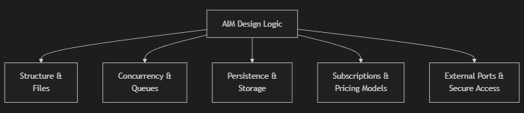

# AIM Building Guide

This section introduces how an **AIM (AI Machine)** is designed, structured, and built within the HyperCycle ecosystem.

Before writing code, it is important to understand **what belongs inside an AIM** and **what explicitly does not**.

***

<figure><figcaption></figcaption></figure>

### <mark style="color:blue;">AIM Design & Building Guide Outline:</mark>

* [<mark style="color:yellow;">**AIM Structure & Files**</mark>](../hypercycle-developer-guide/aim-building-guide/aim-structure-and-files.md)\
  Dockerfile requirements, labels, and runtime layout
* [<mark style="color:yellow;">**Endpoint Declaration & Cost Logic**</mark>](../hypercycle-developer-guide/aim-building-guide/endpoint-declaration-and-cost-logic.md)\
  Endpoint decorators, `cost_only`, and usage schemas
* [<mark style="color:yellow;">**Concurrency & Queues**</mark>](../hypercycle-developer-guide/aim-building-guide/concurrency-and-queues.md)\
  Managing parallelism and protecting hardware resources
* [<mark style="color:yellow;">**Persistence & Storage**</mark>](../hypercycle-developer-guide/aim-building-guide/persistence-and-storage.md)\
  Volumes, `/container_mount`, and subscription state
* [<mark style="color:yellow;">**Subscriptions & Pricing Models**</mark>](../hypercycle-developer-guide/aim-building-guide/subscriptions-and-pricing-models.md)

  Async jobs, subscriptions
* [<mark style="color:yellow;">**External Ports & Secure Access**</mark>](../hypercycle-developer-guide/aim-building-guide/external-ports-and-secure-access.md)\
  External ports, infrastructure AIMs

Once you understand these key components, you will be able to build production-grade AIMs that integrate cleanly into the HyperCycle network.

### <mark style="color:blue;">Design Principles for AIM APIs</mark>

When designing AIM APIs, authors should aim for:

* Clear, minimal interfaces
* Deterministic behavior
* Explicit cost reporting
* No hidden side effects
* Separation of service logic from infrastructure concerns

Following these principles ensures AIMs remain:

* Composable
* Reusable
* Safe to deploy across heterogeneous nodes

***

### <mark style="color:blue;">Cost Declaration and Usage Reporting</mark>

AIMs **participate in pricing**, but do not enforce it.

An AIM may:

* Return a fixed cost
* Return variable cost based on input
* Report usage metrics (tokens, seconds, frames, etc.)

The Node Manager uses this information to:

* Deduct balances
* Enforce pricing rules
* Track usage across calls and subscriptions

An AIM never:

* Deducts payment
* Interacts with wallets
* Enforces access rules

***

### <mark style="color:blue;">Cost Estimation (</mark><mark style="color:blue;">`cost_only`</mark><mark style="color:blue;">)</mark>

All AIM APIs must support cost estimation.

When invoked in `cost_only` mode:

* The AIM must **not perform full execution**
* The AIM returns an **estimated cost or usage**
* No state is modified
* No expensive resources are allocated

This allows clients and UIs to preview pricing before execution.

> `cost_only` requests must be fast, deterministic, and side-effect free.

***

### <mark style="color:blue;">Execution Requests</mark>

When invoked for execution:

* The AIM performs full computation
* Actual usage is calculated and reported
* Results are returned to the Node Manager

The AIM does **not** know:

* Who the end user is
* How payment is deducted
* Whether the request is prepaid or subscription-based

The Node Manager is the trust and enforcement boundary.

***

### <mark style="color:blue;">Stateless by Default</mark>

AIMs are **stateless by default**.

Unless explicitly configured otherwise:

* Containers may be restarted at any time
* Local filesystem state must not be assumed
* Execution must be idempotent

Persistence is only available when explicitly enabled via:

* Node configuration
* Container labels
* Mounted volumes (e.g. `/container_mount`)

AIM authors must not assume persistence unless it is declared and documented.

***

### <mark style="color:blue;">Typical AIM File Structure</mark>

A minimal AIM follows a predictable structure:

```
aim/
├── Dockerfile
├── main.py
├── requirements.txt
├── manifest.json
```

#### <mark style="color:yellow;">Key Files</mark>

* **Dockerfile**\
  Defines the runtime environment and dependencies.
* **main.py**\
  Application server implementing AIM endpoints.
* **requirements.txt**\
  Python dependencies required by the AIM.
* **manifest.json**\
  Declares metadata, pricing, endpoints, and configuration.

This structure allows Node Managers, registries, and tooling to reason about AIMs consistently.

***

### <mark style="color:blue;">Container Responsibilities</mark>

Inside the container, the AIM is responsible for:

* Exposing HTTP endpoints
* Executing compute logic
* Estimating cost and reporting usage
* Returning results

Outside the container, the Node Manager handles:

* Authentication and signature verification
* Payment enforcement
* Balance tracking
* Request routing

This separation is fundamental to HyperCycle’s design.

***

### <mark style="color:blue;">What’s Next</mark>

[<mark style="color:yellow;">**AIM Structure & Files**</mark>](../hypercycle-developer-guide/aim-building-guide/aim-structure-and-files.md)\
Dockerfile requirements, labels, and runtime layout
