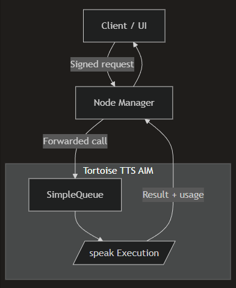

# Concurrency & Queues

This section explains how AIMs manage concurrency and protect limited resources using queues.

All concrete examples on this page use the **Tortoise TTS AIM**, which inherits from `SimpleQueue`.

***

### <mark style="color:blue;">Why Queues Matter</mark>

AIMs often run on constrained or expensive hardware:

* GPUs
* NPUs
* Specialized accelerators
* Limited memory environments

Without concurrency control:

* Requests may overwhelm the system
* Performance becomes unpredictable
* Costs become difficult to enforce

Queues allow AIM authors to:

* Limit parallel execution
* Serialize access to hardware resources
* Provide predictable execution behavior

***

### <mark style="color:blue;">SimpleQueue: Synchronous Concurrency Control</mark>

`SimpleQueue` is the default concurrency mechanism used by many AIMs.

It provides:

* FIFO request handling
* Bounded concurrency
* Automatic backpressure

Execution remains **synchronous** from the client’s perspective.

***

### <mark style="color:yellow;">Example: Tortoise TTS AIM Using</mark> <mark style="color:yellow;"></mark><mark style="color:yellow;">`SimpleQueue`</mark>

The Tortoise TTS AIM inherits from `SimpleQueue`: (taken from [full example](../../hypercycle-developer-guide/aim-building-guide/aim-structure-and-files/aim-main.py.md))

```python
from pyhypercycle_aim import JSONResponseCORS, SimpleQueue, aim_uri

class TortoiseAim(SimpleQueue):
    ...
```

By inheriting from `SimpleQueue`, the AIM ensures:

* Only a limited number of requests execute concurrently
* GPU resources are not oversubscribed
* Requests are processed in order

No additional queue management logic is required in the endpoint code.

***

### <mark style="color:yellow;">Execution Flow with SimpleQueue</mark>

<div align="left"><figure><figcaption></figcaption></figure></div>

Key properties:

* Requests are queued before execution
* Execution happens one request at a time (or up to the configured limit)
* The client blocks until execution completes

***

### <mark style="color:blue;">Queue Behavior and Cost Estimation</mark>

`cost_only` requests **do not execute** and therefore:

* Do not enter the execution queue
* Do not consume queue capacity
* Return immediately

This ensures:

* Pricing previews remain fast
* Queue backlog does not affect estimation
* Execution resources are reserved for real work

This behavior is handled explicitly in endpoint logic, not by the queue itself.

***

### <mark style="color:blue;">When to Use SimpleQueue</mark>

`SimpleQueue` is ideal when:

* Execution time is short to moderate
* Results are returned immediately
* Hardware resources must be protected
* Clients expect synchronous responses

The Tortoise TTS AIM fits this model well.

***

### <mark style="color:blue;">AsyncQueue (Conceptual Overview)</mark>

For long-running or high-latency tasks, HyperCycle provides `AsyncQueue`.

Examples include:

* Model training
* Large dataset processing
* Long-running inference jobs
* Batch transformations

With `AsyncQueue`, the call pattern changes:

1. Client submits a request (e.g. `/translate`)
2. Server returns a `job_number`
3. Client later queries `/result?job_number=...`
4. (Optional) `/queue` exposes job status

Key features:

* Jobs are stored with metadata (inputs, submitter, result)
* Only the submitting user can retrieve the result
* Execution and retrieval are decoupled
* Jobs can run for minutes or hours

> This guide does not include an `AsyncQueue` implementation example.\
> See advanced AIM examples for concrete usage.

***

### <mark style="color:blue;">SimpleQueue vs AsyncQueue</mark>

| Feature            | SimpleQueue | AsyncQueue   |
| ------------------ | ----------- | ------------ |
| Execution model    | Synchronous | Asynchronous |
| Client waits       | Yes         | No           |
| Job IDs            | No          | Yes          |
| Long-running tasks | No          | Yes          |
| GPU protection     | Yes         | Yes          |

***

### <mark style="color:blue;">Summary</mark>

Using the Tortoise TTS AIM as reference:

* `SimpleQueue` provides safe, synchronous concurrency control
* Queues protect hardware resources
* Cost estimation bypasses execution queues
* Execution remains predictable and enforceable

Queue selection is a **design decision** based on workload characteristics.

***

### <mark style="color:blue;">What’s Next</mark>

The next section introduces state and persistence:

[<mark style="color:yellow;">**Persistence & Storage**</mark>](../../hypercycle-developer-guide/aim-building-guide/persistence-and-storage.md)

That section explains:

* `/container_mount`
* Volume labels
* When AIMs can safely store state
