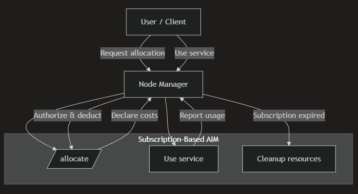

# Subscriptions & Pricing Models

This section explains how pricing works in HyperCycle, how subscriptions differ from per-call pricing, and how AIMs participate in pricing **without enforcing payment**.

HyperCycle separates **pricing declaration**, **usage reporting**, and **payment enforcement** across different layers of the system.

***

### <mark style="color:blue;">Two Primary Pricing Models</mark>

HyperCycle supports two primary pricing models:

1. **Per-Call Pricing**
2. **Subscription-Based Pricing**

***

### <mark style="color:blue;">Pricing Is Declarative, Not Enforced</mark>

AIMs do **not** enforce payment.

Instead, AIMs:

* Declare pricing intent
* Estimate cost
* Report usage

The Node Manager:

* Verifies authorization
* Tracks balances
* Deducts funds
* Enforces limits

This separation allows:

* Flexible pricing models
* Clean AIM logic
* Consistent enforcement across the network

***

### <mark style="color:blue;">Per-Call Pricing</mark>

Per-call pricing charges the user for each execution of an endpoint.

#### Characteristics

* Cost is calculated per request
* `cost_only` previews pricing
* Usage is reported after execution
* No long-lived state is required

#### [<mark style="color:yellow;">Example: Tortoise TTS AIM</mark>](../../hypercycle-developer-guide/aim-building-guide/aim-structure-and-files/aim-main.py.md)

The Tortoise TTS AIM uses per-call pricing:

* Cost scales with input text length
* Each `/speak` call is independent
* No persistence is required

The AIM:

* Estimates cost using `estimate(text)`
* Reports usage using `used` fields
* Returns results immediately

This model is ideal for:

* Stateless inference
* Short-running jobs
* Pay-as-you-go services

***

### <mark style="color:blue;">Subscription-Based Pricing</mark>

Subscription-based pricing charges users for **ongoing access to a resource** over time.

Subscriptions are commonly used for:

* Persistent storage
* Bandwidth allocation
* Long-lived services
* Resource reservations

In this model:

* Users pay upfront or periodically
* Usage is tracked over time
* Access may depend on subscription state

***

### <mark style="color:blue;">Subscriptions and AIM Responsibilities</mark>

When using subscriptions, AIMs are responsible for:

* Reporting usage against subscription limits
* Querying subscription state when needed
* Cleaning up resources when subscriptions expire

AIMs are **not** responsible for:

* Charging users
* Managing wallets
* Enforcing payment rules

***

### [<mark style="color:yellow;">Example: CDN AIM Subscription Model</mark>](../../hypercycle-developer-guide/aim-building-guide/persistence-and-storage/example-cdn-aim.md)

The CDN AIM demonstrates a full subscription-based model.

#### What Is Subscribed

Users subscribe to:

* Disk space (storage)
* Bandwidth quota
* Subscription duration (months)

#### How Pricing Works

* Storage is charged per GB per month
* Bandwidth is charged per GB consumed
* Costs are declared and reported by the AIM
* Enforcement is handled by the Node Manager

***

### <mark style="color:yellow;">Subscription Lifecycle</mark>

<figure><figcaption></figcaption></figure>

This flow shows:

* Allocation and pricing declaration
* Ongoing usage reporting
* Automatic cleanup on expiration

***

### <mark style="color:blue;">Tracking Subscription State</mark>

Subscription state is tracked using `SubscriptionManager`.

In the [<mark style="color:yellow;">CDN AIM</mark>](../../hypercycle-developer-guide/aim-building-guide/persistence-and-storage/example-cdn-aim.md):

* Each disk has a subscription
* Metadata includes size, owner, disk ID
* Expiration is checked periodically
* Cleanup occurs automatically

This ensures:

* No orphaned resources
* Predictable lifecycle management
* Clear ownership boundaries

***

### <mark style="color:blue;">Storage and Bandwidth as Priced Resources</mark>

Subscriptions often combine **execution pricing** with **resource pricing**.

Using `StorageManager`, AIMs can:

* Track bandwidth consumption
* Track storage usage
* Report usage as billable units

This allows pricing models such as:

* “$X per GB per month”
* “$Y per GB transferred”
* Quota-based subscriptions

***

### <mark style="color:blue;">Mixing Pricing Models</mark>

Many AIMs mix pricing models:

* Subscription for access or capacity
* Per-call pricing for execution
* Usage-based pricing for bandwidth or storage

This hybrid approach enables:

* Predictable base cost
* Fair usage-based billing
* Scalable services

The [<mark style="color:yellow;">CDN AIM</mark>](../../hypercycle-developer-guide/aim-building-guide/persistence-and-storage/example-cdn-aim.md) is a canonical example of this pattern.

***

### <mark style="color:blue;">`cost_only`</mark> <mark style="color:blue;"></mark><mark style="color:blue;">and Subscriptions</mark>

Even in subscription-based AIMs:

* `cost_only` must be supported
* Allocation and usage previews must be deterministic
* No state may be modified during estimation

This allows clients to:

* Preview subscription cost
* Estimate upgrades or extensions
* Build pricing UIs safely

***

### <mark style="color:blue;">Summary</mark>

Key points to remember:

* AIMs declare pricing, never enforce it
* Per-call pricing is stateless and immediate
* Subscriptions manage long-lived resources
* Storage and bandwidth are first-class billable units
* The Node Manager is the enforcement boundary

This model allows HyperCycle to support **flexible economic designs** without coupling AIM logic to payment infrastructure.

***

### <mark style="color:blue;">What’s Next</mark>

The next section covers **non-HTTP service access**:

[<mark style="color:yellow;">**External Ports & Secure Access**</mark>](../../hypercycle-developer-guide/aim-building-guide/external-ports-and-secure-access.md)

That section explains:

* Exposing additional ports
* Long-running services
* Secure access patterns
* When direct access is appropriate
