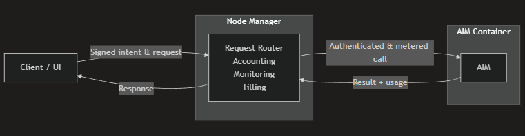

# Developer Build Guide

Architecture, APIs, and AIM Building Guide

## What Is HyperCycle?

HyperCycle is foundational infrastructure for the Internet of AI (IoAI), a decentralized, peer-to-peer network that allows autonomous AI agents and services to securely discover each other, exchange computation, and transact value without intermediaries.

By combining ledgerless consensus (TODA/IP), hierarchical identity and asset structures (Earth64), and performance-driven node economics powering wealth creation, HyperCycle enables scalable, low-latency, machine-to-machine collaboration that transforms isolated AI systems into a globally connected computational ecosystem.

Designed to enable:

* Low-latency, low cost AI service calls
* Pay-per-use and subscription-based pricing models
* Independent AI services (AIMs) running on heterogeneous hardware
* Clean separation between execution, payments, and discovery

HyperCycle is not a single API or service. It is an **ecosystem** composed of nodes, registries, explorers, and AI machines working together as a foundation for the Internet of AI (IoAI).

***

## <mark style="color:blue;">Scope of This Guide</mark>

This guide focuses on:

* **Core components** and how they work together
* **Interaction and execution flow** across clients, nodes, and AIMs
* **API surfaces** used for discovery, execution, and monitoring
* **Practical AIM build walkthroughs and examples** that reflect real deployments

It intentionally does **not** cover blockchain internals, governance, or token economics.

***

## <mark style="color:blue;">Core Components</mark>

HyperCycle consists of four major components:

* **Nodes**&#x20;
* **Node Manager**
* **AIMs (AI Machines)**
* **Network & Registry Services**

### <mark style="color:$success;">1. Nodes</mark>

A **node** is a machine (typically Linux) running HyperCycle software and providing compute resources to the network.

A node may host:

* One or more **AIMs**
* One **license (ANFE/Node Factory)**
* A **Node Manager**

> **Important**\
> Nodes do not expose AIMs directly to the public internet by default. This requires additional consideration between node host and LAN to WAN routes/port forwarding. All access is routed and metered.&#x20;

***

### <mark style="color:$success;">2. Node Manager (NM)</mark>

The **Node Manager** is the operational core of a HyperCycle node.

It is responsible for:

* Deploying/Managing installed AIMs
* Routing requests to AIM containers
* Verifying signed requests
* Depositing/Deducting balances from users
* Advertising services to the network
* Managing ports, slots, persistence, and permissions

> **Important**\
> AIMs never interact with wallets, or balances directly.\
> The Node Manager is the *only* component that handles payments and authorization.

***

### <mark style="color:$success;">3. AIMs (AI Machines)</mark>

An **AIM** is a self-contained AI service packaged as a **Docker container**.

An AIM:

* Exposes HTTP endpoints
* Declares its pricing and capabilities
* Runs independently of the Node Manager
* Focuses *only* on service logic

***

### <mark style="color:$success;">4. Network & Registry Services</mark>

HyperCycle provides several **network-level APIs** that are not tied to a single node:

* **AIM Registry API** – Indexed AIM discovery
* **License / HMS APIs** – License activation and state
* **Uptime & Explorer APIs** – Network observability and auditing

These APIs are **read-only** and safe for dashboards, analytics, and discovery.

***

## <mark style="color:blue;">Interaction Model & Flow</mark>

HyperCycle is designed around a strict separation of concerns between **clients**, **node managers**, and **AIMs**.

<figure><figcaption></figcaption></figure>

At a high level:

* Clients initiate requests and sign intent to spend
* Node Managers authenticate, meter, and route requests
* AIMs execute computation and report usage

The exact execution flow, request sequencing, and client-side logic are covered in later sections of this guide.

This design allows:

* Multiple UI patterns
* Multiple payment strategies
* Flexible AIM execution models
* Community-driven tooling and discovery

***

## <mark style="color:blue;">Responsibility Boundaries</mark>

Clear separation of responsibility is fundamental to HyperCycle.

### AIM Responsibilities

* Execute AI logic
* Declare cost and usage
* Expose service endpoints
* Manage internal resources

AIMs **do not**:

* Handle payments
* Verify signatures
* Authenticate users

***

### Node Manager Responsibilities

* Signature verification
* Balance management
* Payment deposit/deduction
* AIM port and container orchestration/security
* Network advertisement, blockchain interactions

***

### Client / UI Responsibilities

Client Applications (UIs, SDKs, Scripts):

* Web UIs
* Backend services
* CLI tools
* SDK-based integrations

Clients:

* Discover available AIMs
* Estimate cost (`cost_only`)
* Sign requests
* Display results to users
* Discover services
* Estimate cost
* Sign requests
* Render results
* Handle UX flows

***

## <mark style="color:blue;">Costing & Metering Model</mark>

HyperCycle uses a **two-phase costing model**:

1. **Estimation phase**
   * Triggered with `cost_only`
   * No payment or signature required
   * Returns estimated cost ranges
2. **Execution phase**
   * Signed request
   * AIM returns actual usage
   * Node Manager deducts balance

Costs may be fixed, variable, subscription-based, or defined using custom virtual currencies.

***

## <mark style="color:blue;">Persistence & State</mark>

By default, AIMs are **stateless**.

State is preserved only when explicitly requested via:

* Docker labels such as `PERSIST_VOLUME=1`
* The `/container_mount` volume

This ensures predictable behavior, safe restarts, and clear ownership of state.

***

## <mark style="color:blue;">What’s Next</mark>

The next sections will cover:

* **APIs** – Discovering and interacting with HyperCycle services
* **AIM Building** – Creating and deploying custom AI Machines
* **Advanced Patterns** – Streaming, subscriptions, storage, and secure access

#### <mark style="color:yellow;">You are ready to build on HyperCycle!!</mark>
